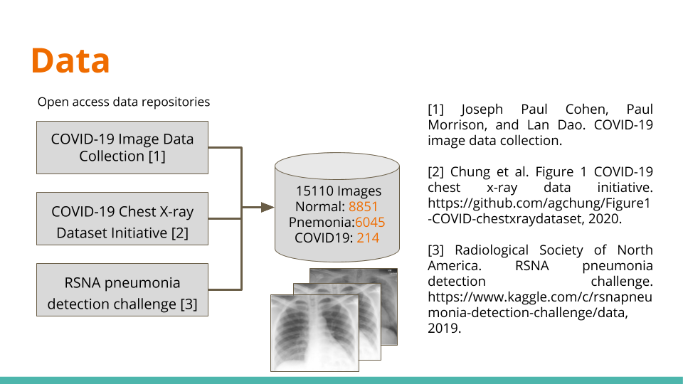
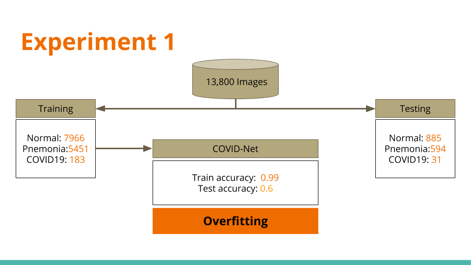
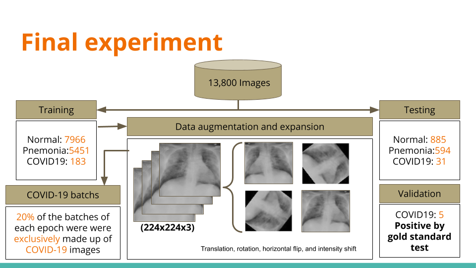
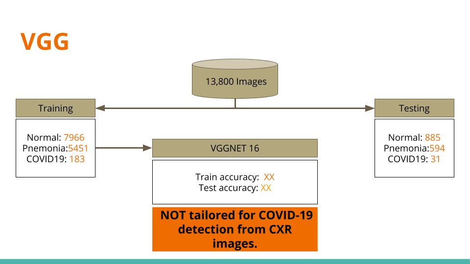

# Detection of COVID-19 Cases from Chest X-Ray Images
###### Based on COVID-NET: https://github.com/lindawangg/COVID-Net
###### And 
##### COVID-NET IN KERAS: https://github.com/busyyang/COVID-19

The COVID-19 pandemic continues to have a devastating effect on the health and well-being of the global population, and a critical step in the fight against COVID-19 is effective screening of infected patients. 
Objective: Classification of chest radiography images in one of three classes (Normal,Pneumonia, COVID-19).
Performance metric: Accuracy

### Reproduction process for final experiment:

1. In order to download the dataset of images and create test and train folder, run: create_dataset.ipynb
2. Training process is faster runnig from a python file than a jupyter notebook, so from terminal run: python train.py
    * Training process last 50 h approximately in a NVIDIA 8117MiB
    
    * Files for traininig and test accuracy and loss history are saved as csv as well as true and predicted y
    * Model is saved as model.h5
3. Run covid_classification.ipynb to visualize results

## Experiment 1. Using covinet-keras
### Whithout any training process on batches

### run: python covidnetkeras.py 

## Final experiment

### using covinet-keras and modification on batch files on training (generator) taken from original covidnet resopository 

## Confusion  Matrix

### Sensitivity 

| Normal   |Pneumonia      |COVID-19|
|----------|:-------------:|------: |
| 97.0%    |  90.0%        | 87%    |

### Positive Predictive Value 

| Normal   |Pneumonia      |COVID-19|
|----------|:-------------:|------: |
|97.0%     |  90.0%        | 87%    |

### Negative predictive value

| Normal   |Pneumonia      |COVID-19|
|----------|:-------------:|------: |
|97.0%     |  90.0%        | 87%    |

## Other experiment

### Just for validate another options, VGG16

